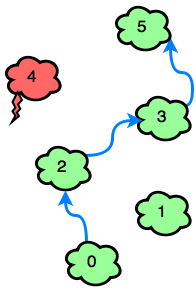

# 🥋 Desafio HackerRank: Jumping On Clouds

Este repositório contém a solução de um popular desafio de programação do HackerRank, o "Jumping On Clouds" implementado em linguagem `C#`. **O desafio consiste em contar o número de pulos minimos necessários para sair da primeira nuvem ☁️ até a última. Lembrando que essas núvens são representadas por uma array de `0` e `1`, onde `1` são núvens carregadas 🌩️ e `0` são núvens comuns ☁️ . Só podemos pular para as comuns e podemos pular para a logo a nossa frente ou para duas a frente.** O objetivo é chegar ao final o mais rápido possível então, iremos preferir sempre pular para duas a frente, quando possível.

## 🔗 Links

**Desafio:** https://www.hackerrank.com/challenges/jumping-on-the-clouds

## 🎬 Vídeo

[](https://youtu.be/j5HtYf-qjZU)

---

## 📝 Problema

<details>
<summary>Português (Brasil)</summary>

### Problematica

Há um novo jogo para celular que começa com nuvens numeradas consecutivamente. Algumas das nuvens são nuvens de tempestade e outras são comuns. O jogador pode pular em qualquer nuvem comum que tenha um número igual ao número da nuvem atual mais `1` ou `2`. O jogador deve evitar as tempestades. **Determine o número mínimo de saltos necessários para saltar da posição inicial até a última nuvem. Sempre é possível ganhar o jogo**.

Para cada jogo, você receberá uma série de nuvens numeradas `0` se forem seguras ou `1` se devem ser evitadas.

**Exemplo:**

```csharp
c = [0, 1, 0, 0, 0, 1, 0]
```
Indexe a matriz de `0` ... `6`. O número em cada nuvem é o seu índice na lista, portanto o jogador deve evitar as nuvens nos índices `1` e `5`. Eles poderiam seguir estes dois caminhos: `0` ↠ `2` ↠ `4` ↠ `6` ou `0` ↠ `2` ↠ `3` ↠ `4` ↠ `6`. O primeiro caminho dá `3` saltos enquanto o segundo dá `4` saltos. Retornar `3`.

### Descrição

Complete a função `jumpingOnClouds`.

`jumpingOnClouds` tem os seguintes parâmetros:
- `int c[n]`: uma array de inteiros binários.

### Retorna

`int`: o número mínimo de saltos necessários.

### Formato de Entrada

A primeira linha contém um número inteiro `n`, o número total de nuvens. A segunda linha contém `n` inteiros binários separados por espaço que descrevem nuvens `c[i]` onde `0 <= i < n`.

### Regras:

- `2 <= n <= 100`
- `c[i] ∋ {0,1}` <sup><sub>( ∋ = contém )</sup></sub>
- `c[0] = c[n - 1] = 0`

### Formato de Saída:

Exiba o número mínimo de pulos necessários para ganhar o jogo.

### Demonstração:

```csharp
7
0 0 1 0 0 1 0
```
**Resultado:**
`4`

### Explicação:

O jogador deve evitar `c[2]` e `c[5]`. O jogo pode ser ganho com um mínimo de `4` pulos:


### Outro Exemplo:

#### Demonstração:

```csharp
6
0 0 0 0 1 0
```
**Resultado:**
`3`

### Explicação:

A única nuvem que deve ser evitada é a `c[4]`. O jogo pode ser ganho com `3` pulos:



</details>

<details>
<summary>English</summary>

There is a new mobile game that starts with consecutively numbered clouds. Some of the clouds are thunderheads and others are cumulus. The player can jump on any cumulus cloud having a number that is equal to the number of the current cloud plus `1` or `2`. The player must avoid the thunderheads. Determine the minimum number of jumps it will take to jump from the starting postion to the last cloud. It is always possible to win the game.

For each game, you will get an array of clouds numbered `0` if they are safe or `1` if they must be avoided.

**Example:**

Index the array from `0` ... `6`. The number on each cloud is its index in the list so the player must avoid the clouds at indices `1` and `5`. They could follow these two paths: `0` ↠ `2` ↠ `4` ↠ `6` or `0` ↠ `2` ↠ `3` ↠ `4` ↠ `6`. The first path takes `3` jumps while the second takes `4`. Return `3`.

### Function Description

Complete the `jumpingOnClouds` function in the editor below.

jumpingOnClouds has the following parameter(s):

- `int c[n]`: an array of binary integers

### Returns

`int`: the minimum number of jumps required

### Input Format

The first line contains an integer , the total number of clouds. The second line contains `n` space-separated binary integers describing clouds `c[i]` where `0 <= i < n`.

### Constraints

- `2 <= n <= 100`
- `c[i] ∋ {0,1}` <sup><sub>( ∋ = contains )</sup></sub>
- `c[0] = c[n - 1] = 0`

### Output Format

Print the minimum number of jumps needed to win the game.

### Sample Input

```csharp
7
0 0 1 0 0 1 0
```
### Sample Output
`4`

### Explanation

The player must avoid `c[2]` and `c[5]`. The game can be won with a minimum of `4` jumps:


### Another example

#### Sample Input
```csharp
6
0 0 0 0 1 0
```

#### Sample Output
`3`

#### Explanation

The only thundercloud to avoid is `c[4]`. The game can be won in `3` jumps:


</details>