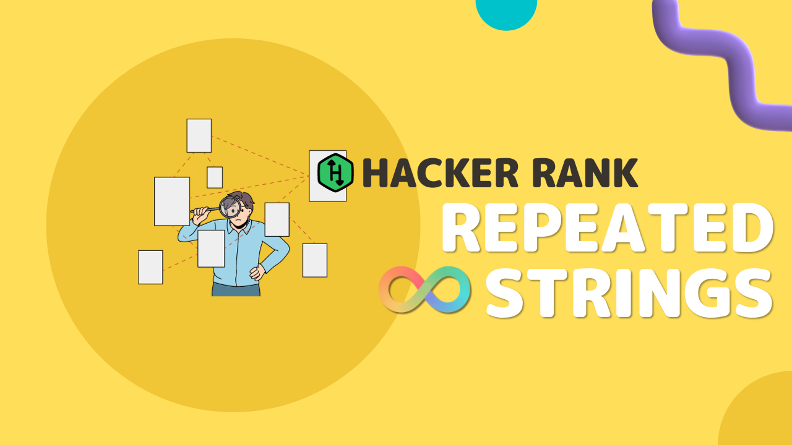

# 🥋 Desafio HackerRank: RepeatedString

Este repositório contém a solução de um popular desafio de programação do HackerRank, o "Repeated String" implementado em linguagem `C#`. **O desafio consiste em contar quantas vezes a letra `a` se repete na string `s` passada. Lembrando que essa string `s` tera que se repeteri ate preencher o valor `n` passado.**

> Vale evidenciar que não é multiplicar pelo `n` e sim fazer que o `s` se repita até que a quantidade de caracteres sejam igual a `n`.

## 🔗 Links

**Desafio:** https://www.hackerrank.com/challenges/repeated-string

## 🎬 Vídeo

[](https://youtu.be/3iuOM0CxJf0)

## 🇧🇷 Tradução do exercício

Há uma sequência `s` de letras minúsculas em inglês que é repetida infinitamente muitas vezes. Dado um número inteiro, `n`, encontre e imprima o número de letras `a` nas primeiras letras `n` da string infinita.

## Exemplo

```shell
s = "abcac"
n = 10
```


A substring que consideramos é `abcacabcac`, as primeiras `10` letras dessa string infinita. Existem `4` ocorrências da letra 'a' na substring.

## Descrição

Complete a função `repeatedString`.

`repeatedString` tem os seguintes parâmetros:

- `s`: uma string a ser repetida
- `n`: o número de caracteres a considerar

## Retorno

- `int`: o número de ocorrências da letra `a` na substring.

## Formato de Entrada

A primeira linha contém uma única string, `s`.
A segunda linha contém um inteiro, `n`.

## Restrições

- `1 <= |s| <= 100`
- `1 <= n <= 10^12`
- Para `25%` dos casos de teste, `n <= 10^6`.

## Exemplo de Entrada 0

```shell
aba
10
```
**Resultado:** `7`

**Explicação 0:** As primeiras `n=10` letras da string infinita são `abaabaabaa`. Como existem 7 `a`, retornamos `7`.

## Exemplo de Entrada 1

```shell
a
1000000000000
```

**Resultado:** `1000000000000`

**Explicação 1:** Como todas as primeiras letras `n = 1000000000000` da string infinita são `a`, retornamos `1000000000000`.
